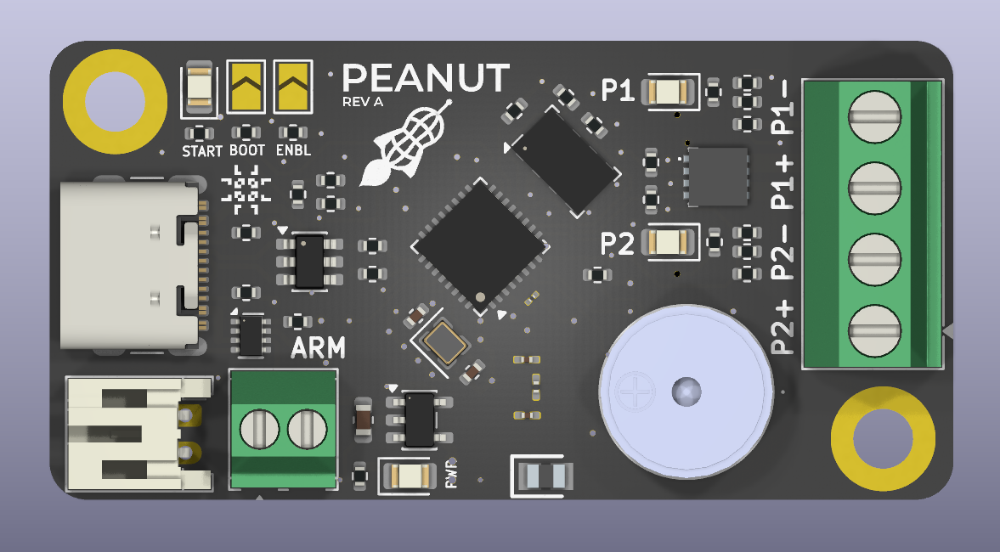

# Peanut

    
     
    Peanut Altimeter

A modern, tiny, and hackable altimeter for hobby rocketry. Features include:

* Dual deploy capable (two pyro channels)
* Visual continuity LEDs
* On-board 1MB storage
  * Barometric altitude measurements
  * Flight events (ascent, apogee, landing, etc.)
  * Deployment events
* Mach dip filtering (works on flights that break Mach)
* On-board, time-stamped altitude and deployment event logging
* Audio arming indicator
* Bluetooth connection
  * Deployment testing with flight simulations over BLE
  * Configuration over BLE
  * Continuity & other telemetry over BLE
* WiFi capable

## Firmware

The firmware for this board is made using the [Apache NuttX RTOS][nuttx-site],
an open-source embedded RTOS with an incredible community and an excellent
feature set.

Firmware is spread across a few repositories. If you are compiling yourself,
you'll need:
- [The NuttX kernel source][nuttx]
- [The NuttX application library][nuttx-apps]
- The Peanut board support package (coming soon)
- [My application-level altimeter software][rocket-altimeter]

## Hackability

All hardware designs & firmware for Peanut are open-sourced and available under
permissive licensing.

The device itself is programmable over the USB-C interface, so users can tweak
the firmware or write their own and re-program the device. Want the buzzer to
play custom audio? Want to change the meaning of the "START" LED? Want to add
more features to the Bluetooth interface, or make the altimeter operate over
WiFi instead? You can program whatever you want into it.

## Make Your Own

If you want to make your own Peanut Altimeter, the component cost for the board
is roughly $45 CAD. You can get PCB blanks from a manufacturer of your choice
(JLCPCB/PCBWay). You should only need to verify the trace widths of the
Bluetooth RF trace depending on the differences between your manufacturer's
PCB stackup and mine.

**NOTE:** This board was not designed with hand-soldering in mind (aside from
the backside). My manufacture process is to use solder paste, a stencil and a
hot plate to do the top-side components. There are 0402 components which are
manageable with steady hands and tweezers, but the RF matching network is three
0201 components, which require a lot of patience.

[nuttx]: https://github.com/apache/nuttx
[nuttx-apps]: https://github.com/apache/nuttx-apps
[nuttx-site]: https://nuttx.apache.org/
[rocket-altimeter]: https://github.com/linguini1/rocket-altimeter
